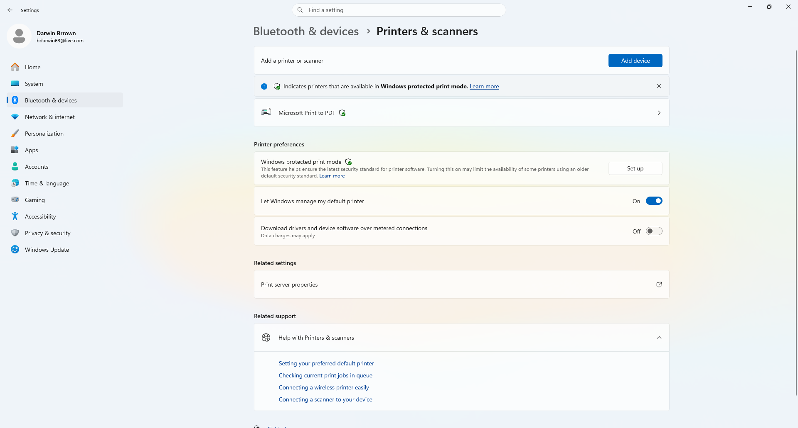
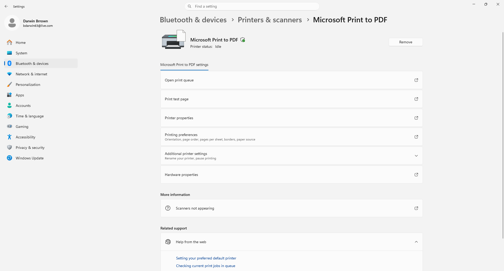
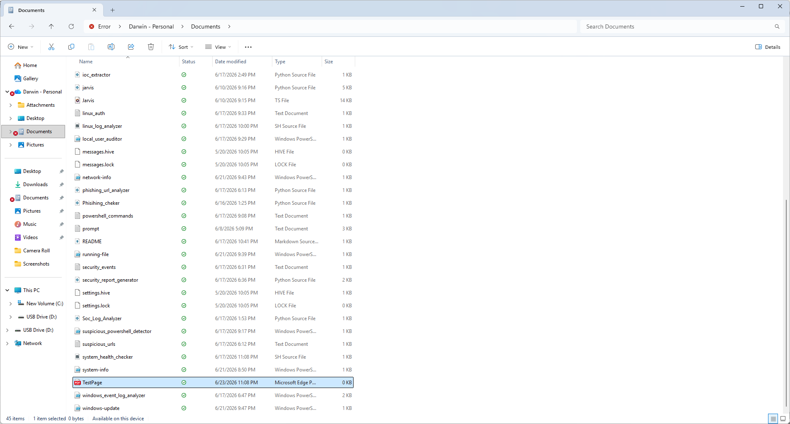
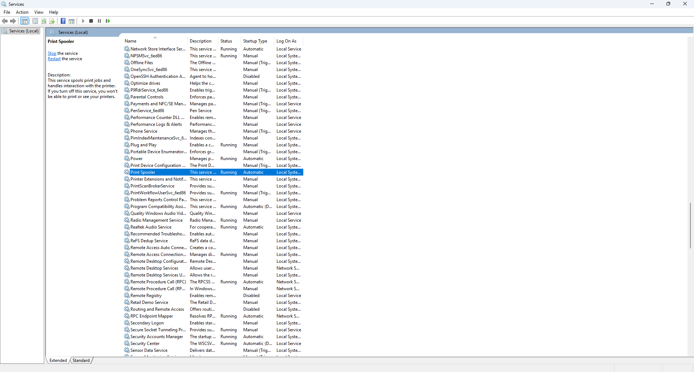
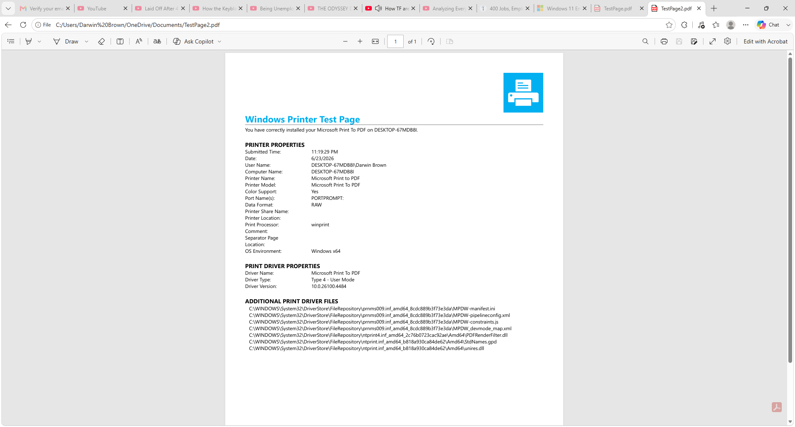

# Darwin Printer Troubleshooting Lab

## Overview

This project demonstrates a common Help Desk support scenario involving Windows printer troubleshooting.

The lab walks through diagnosing printer issues, verifying printer configuration, checking the print queue, restarting the Print Spooler service, and validating printer functionality by successfully printing a Windows test page.

This project simulates tasks commonly performed by Tier 1 Help Desk and Desktop Support technicians.

---

## Objectives

- Verify printer installation
- Inspect printer settings
- Check printer status
- Review print queue
- Restart the Print Spooler service
- Print a Windows test page
- Verify successful printer functionality

---

## Environment

- Windows 11 Pro
- Microsoft Print to PDF
- Windows Services (services.msc)
- Print Management
- Microsoft Edge PDF Viewer

---

## Skills Demonstrated

- Windows 11 Administration
- Printer Troubleshooting
- Print Queue Management
- Print Spooler Service Management
- Windows Services
- Device Management
- Help Desk Troubleshooting
- Technical Documentation
- Root Cause Analysis

---

## Troubleshooting Process

### Step 1

Verified installed printers.

---

### Step 2

Opened printer settings and reviewed configuration.

---

### Step 3

Checked the print queue for pending print jobs.

Result:

- No stuck print jobs were found.

---

### Step 4

Attempted to print a Windows Test Page.

Result:

- Initial PDF output failed to open correctly.

---

### Step 5

Opened Windows Services.

Verified the **Print Spooler** service was running.

---

### Step 6

Restarted the Print Spooler service.

---

### Step 7

Printed a second Windows Test Page.

Result:

- Test page generated successfully.
- Printer functionality restored.

---

# Screenshots

## 1. Printers & Scanners

Displays installed printers.

---

## 2. Printer Properties

Viewing Microsoft Print to PDF configuration.

---

## 3. Print Queue

Checking for pending print jobs.

---

## 4. Initial Test Page Failure

First test page produced an invalid PDF.

---

## 5. Print Spooler Service

Verified Print Spooler service status.

---

## 6. Restarting Print Spooler

Restarted the Print Spooler service to refresh the printer subsystem and resolve the PDF printing issue.

---

## 7. Successful Test Page

Printer successfully generated a Windows Test Page.

---

## Outcome

The printer issue was resolved after restarting the Print Spooler service. A successful Windows Test Page confirmed proper printer functionality.

---

## Resume Skills

- Windows 11 Administration
- Printer Support
- Print Spooler Management
- Device Troubleshooting
- Desktop Support
- Technical Support
- Help Desk Operations
- IT Troubleshooting
